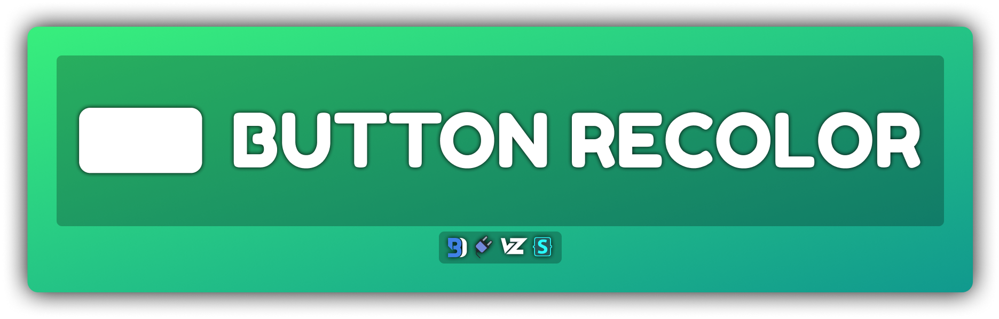

# Button Recolor
Simply change Discord's default button colors.

## Installation
For **[Powercord](http://powercord.dev/)** or **[Vizality](https://vizality.com/)** installation, go to **Themes -> Open a CMD / Powershell / Terminal / Gitbash** in the folder, and enter the following:
```
git clone https://github.com/Discord-Theme-Addons/button-recolor
```

**For BetterDiscord:**
- [Direct Download](https://betterdiscord.net/ghdl?id=)
- [View Source]()

**For Browser / Web:**
1. Install the Stylus extension for [Chrome](https://chrome.google.com/webstore/detail/stylus/clngdbkpkpeebahjckkjfobafhncgmne) / [Firefox](https://addons.mozilla.org/en-US/firefox/addon/styl-us/) / [Opera](https://github.com/openstyles/stylus/wiki/Opera,-Outdated-Stylus).
2. After installing, head over to [this link]().
3. Press the "Install Style" button.

## Recolor Help
Inside the root of the file (can be found in `./index.scss` on powercord, other platforms it will just be in the file) you can mess with the values as you like. They are done in an RGB (Red, Green, Blue) format, so I recommend using [google's colorpicker](https://www.google.com/search?q=colorpicker) to get your desired colors. All button colors are sorted by their color.